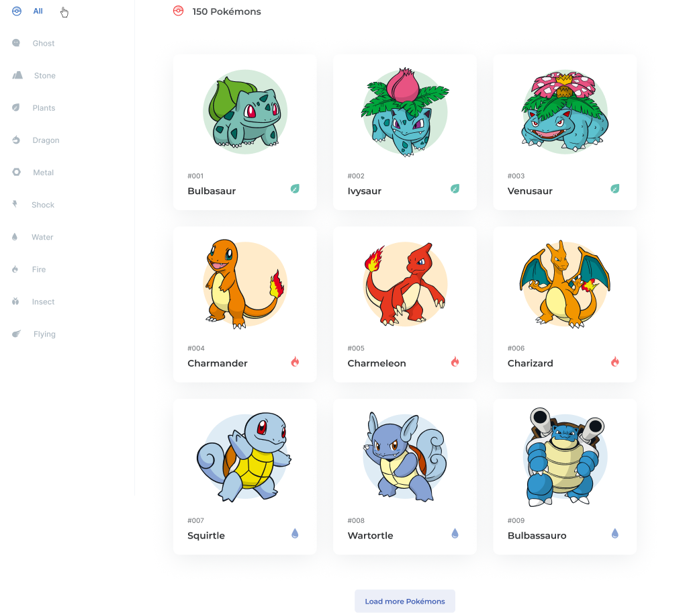

<h1 style='font-weight: 300'><strong>PokemonApi</strong></h1>

This repo contains the **PokemonApi** project following the **[CodeBoost](https://codeboost.com.br)** course.

As usually, on this repo you can found some changes when compare with the course project.

## 🛠 Skills

![html][html] ![sass][sass] ![javascript][javascript] ![gulp][gulp]

## 📄 Roadmap

This is a module of **[CodeBoost](https://codeboost.com.br)** course, where the goal is work with **Gulp** to optimize tasks, like build and minify scrips and styles and integration with a pokemon listing API with all their information.

For style, it's using **Sass** and use **Gulp** to convert to **CSS** and minify at the same time.

### What is missing?

-   [ ] Improve SEO;
-   [ ] Create config to optimize and convert images to `.webp`.

## 🔗 More About Me

[html]: https://img.shields.io/badge/html-1E4174?style=for-the-badge&logo=html5&logoColor=white
[sass]: https://img.shields.io/badge/sass-1E4174?style=for-the-badge&logo=sass&logoColor=white
[javascript]: https://img.shields.io/badge/javascript-1E4174?style=for-the-badge&logo=javascript&logoColor=white
[gulp]: https://img.shields.io/badge/gulp-1E4174?style=for-the-badge&logo=gulp&logoColor=white